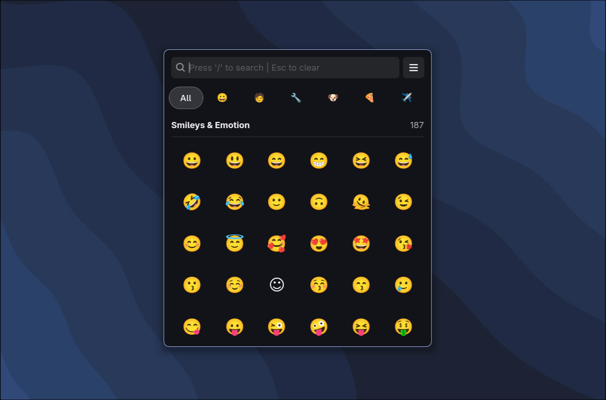

<div align="center">
  

### A fast emoji and Unicode symbol picker for Linux built with GTK4 and Python.

Browse, search, and copy emojis, symbols, emoticons, arrows, currency signs, mathematical symbols, and more from a lightweight overlay window.

---

[](https://github.com/pshycodr/omniglyph/stargazers)
[](https://github.com/pshycodr/omniglyph/network/members)
[](https://github.com/pshycodr/omniglyph/watchers)

[](LICENSE)
[](https://www.python.org/)
[](https://www.gtk.org/)
[](https://gnome.pages.gitlab.gnome.org/libadwaita/)



</div>

## Features

* Fast emoji and Unicode symbol search
* Search by name, keywords, aliases, and Unicode values
* Sidebar navigation for multiple built-in collections
  * Emojis
  * Emoticons
  * Arrows
  * Mathematical symbols
  * Currency symbols
  * Special symbols
  * Hieroglyphs
* Category and subcategory browsing
* Instant clipboard copy
* Collection selection from the command line

## Installation

### Arch Linux

```bash
yay -S omniglyph
```

OR

### Installer Script

```bash
curl -fsSL https://raw.githubusercontent.com/pshycodr/omniglyph/main/scripts/install.sh | bash
```

## Launch

```bash
omniglyph
```

### Open a Specific Collection

```bash
omniglyph --emoji
omniglyph --emoticons
omniglyph --arrows
omniglyph --math
omniglyph --currency
omniglyph --special
omniglyph --hieroglyphs
```

## Building from Source

### Clone Repository

```bash
git clone https://github.com/pshycodr/omniglyph.git
cd omniglyph
```

### Install Dependencies

```bash
uv sync
```

### Run Development Version

```bash
uv run glyph/main.py
```

## Build Release Binary

```bash
source .venv/bin/activate
./scripts/build.sh
```

Output:

```text
out/omniglyph.bin
```

## Requirements

* Python 3.13+
* GTK4
* Libadwaita
* uv
* PyGObject
* Nuitka

## Contributing

See [CONTRIBUTING.md](CONTRIBUTING.md) for contribution guidelines.

## License

This project is licensed under the GPL-3.0 License. See the [LICENSE](LICENSE) file for details.

## Credits

Built by [pshycodr](https://github.com/pshycodr)

## Show Your Support

If you found this project useful, consider giving it a star ⭐

[](https://github.com/pshycodr/omniglyph)

Found a bug or have a feature request? Open an issue on GitHub.
